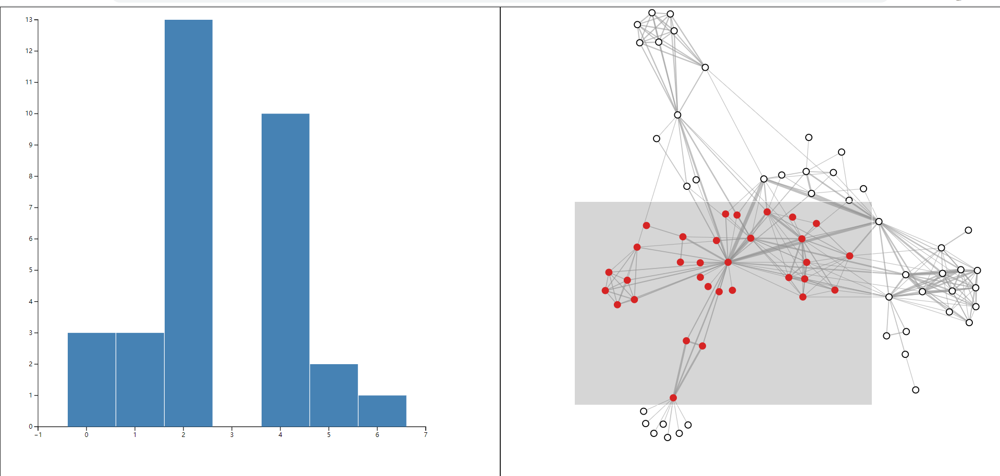

## 作业一（D3实现基本绘图）
### 一、实验目的
- 了解使用H5,CSS,JS使用D3绘制的基本流程
- 理解D3的声明式属性
- 理解D3=big for loop
### 二、实验内容

能够利用H5+CSS+D3实现基本绘图，静态图即可，建议能够自己设计一个新颖图形。

### 三、实验步骤

利用基本图形如圆、长方形、线条等绘制人物图形。

### 四、实验结果

### 五、实验结论

成功利用H5+CSS+D3实现基本绘图，其中线条充当头发、嘴，圆形充当头、眼睛，矩形充当身体和四肢。

### 六、源代码

在./homework1下

## 实验一（动画与交互）
### 一、实验目的

- 加强对D3的声明式属性的理解。
- 加强enter-update-exit模式理解。
- 熟悉使用D3实现交互和动画的流程。

### 二、实验内容

提供一个json数据，该数据为某城市365天的天气数据。包括温度，湿度，云量等等。 根据"windSpeed","moonPhase","dewPoint","humidity","uvIndex","windBearing","temperatureMin","temperatureMax"几个数据项，生成对应的柱状图，并且完成之间的切换动画以及交互功能。

其中湿度分布统计如上图所示，高度记录了湿度处于对应区间的天数统计。
根据提供的模版，数据，更改提供的bars.js等文件，实现如下效果。
 
1.交互
 
鼠标移入某个矩形，改变矩形颜色，矩形上方显示提示框，显示该矩形代表的数据量，鼠标移出，恢复矩形颜色，提示框消失。
注：提示框样式不做要求，但是必须在所选矩形正上方。
2.动画
实现视频中效果。点击右边button，切换柱状图，在切换过程中加入动画。并且为新增数据与移出数据增加颜色标识。
提示：使用d3中的enter()和exit()区分新增数据与移出数据，从而为其添加颜色标识。

### 三、实验步骤

- 编写基础的html框架
- 使用D3读取json文件，并且绘制直方图
- 为直方图添加交互和动画

### 四、实验结果

#### 4.1整体布局

####  4.2交互

 

#### 4.3动画

### 五、实验结论

根据所提供的json数据，生成对应的柱状图，并且参照视频实现效果，完成了不同柱状图之间的切换动画以及交互功能。

### 六、源代码

全部代码见于./experiment1目录下

## 实验二(用umi+react框架可视化并实现交互)
### 一、实验目的

- 熟悉使用D3实现交互和动画的流程。
- 熟悉umi+react框架的结构与使用
- 学习使用D3绘制力导向图和直方图

### 二、实验内容

请同学们提前配置好nodejs并启用yarn。使用yarn add @types/d3导入d3包。

代码文件夹中已提供了umij的基本架构（说明见https://v3.umijs.org/zh-CN/docs/directory-structure）。miserables.json为数据集，按照要求实现如下交互性可视化图表。构建如图1所示的力导向图。为力导向图添加矩形选择框，并根据选择框所选择的节点绘制直方图，如图2所示。

 

 

图1：选择框未选择的状态

 

图2：选择框框选节点，显示所选中节点的分布直方图

### 三、实验步骤

#### 步骤一：绘制力导向图。

根据数据集中的nodes和links构建网络，links中的source代表源节点，target代表目标节点。首先要读取graph.json文件分析出绘图需要的节点和边。在Scatter2中的index.tsx补全代码，绘制力导向图并添加矩形选择框。

#### 步骤二：绘制直方图

由框选的数据作为参数传入Scatter1中，补全index.tsx中的代码。要求根据框选的数据获取数据的分组，并根据分组情况绘制分布直方图，x轴代表分组名，y轴代表每个分组出现的个数。直方图根据力导向图的选择框实时更新。

### 四、实验结果

**4.1 选择框未选择的状态**

**4.2 选择框框选节点，显示所选中节点的分布直方图**

### 五、实验结论

以miserables.json为数据集，成功实现具有交互性可视化图表。在页面右侧绘制力导向图并成功为力导向图添加矩形选择框。根据选择框所选择的节点成功在页面右侧绘制直方图。

### 六、源代码

在./training目录下
## 实验三（网络与层次数据可视化）
### 一、实验目的
本次实验的主要目的是帮助大家初步掌握运用d3和Gephi创建节点链接形式的网络数据可视化的技术。
### 二、实验内容
#### 实验1：绘制WebKit 模块关系依赖图
使用d3力导向绘制WebKit 模块依赖图，代码参考disjoint_graph文件夹中的程序。节点为WebKit的模块，链接为模块间的依赖关系。数据：webkit-dep.json。
要求：效果参考下图。节点根据category染色。鼠标移到节点上高亮节点并显示出其名字。

####  实验2：绘制可视化论文引用网络

节点为可视化领域的论文，链接为论文之间的引用。数据在vis_paper_citation_network文件夹中。

要求：使用Gephi绘制，效果参考下图 。请用Gephi的社区检测算法识别类别，导出识别结果。然后对node的Fields_of_Study字段进行词频统计，得出每个类别的语义。结合语义和图谱中节点的分布写出你的发现（不少于200字）。
